# FYP 2026 — AI-Orchestrated Multimodal Scene Reconstruction from Video

> Thesis context: **“An AI-Orchestrated Multimodal System for Automated Scene Reconstruction from Video”** (Phase II, March 2026).

This repository is the **integration workspace** for the full DXE-style pipeline that converts handheld monocular video into structured, textured, and interactive 3D indoor scenes.

---

## 1) Vision and Scope

This project combines geometric reconstruction, floorplan intelligence, texture generation, and scene-level orchestration into a single research stack.

At a high level:
- **MASt3R-SLAM** estimates camera trajectory + dense geometry from video.
- **FloorNet**/FLOORPLAN logic transforms geometric evidence into structured layout understanding.
- **Plan2Scene** turns 2D/structured layouts into textured architectural meshes.
- **Orchestrator** handles object-level semantic layout planning.
- **Hunyuan3D-2** provides high-quality image-to-3D asset generation.

The thesis framing in `Thesis_Report .pdf` emphasizes:
- Monocular-first reconstruction (no LiDAR dependency).
- Structured scene assembly with collision-aware placement.
- Modular architecture for extensibility and deployment.

---

## 2) System Architecture (Integrated View)

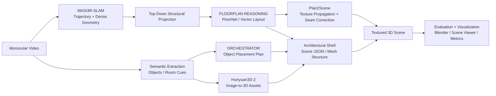

---

## 3) Visual Overview (Paper / Module Figures)

| Component | Visual |
|---|---|
| **FloorNet (ECCV 2018)** |  |
| **MASt3R-SLAM (CVPR 2025)** |  |
| **ORCHESTRATOR** | 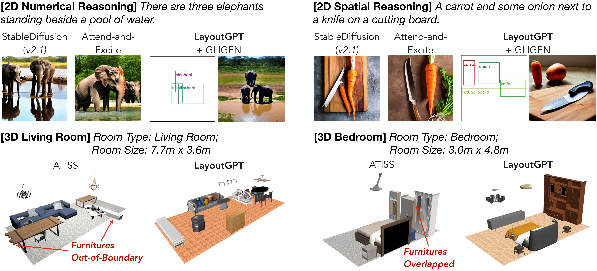 |
| **Plan2Scene** | 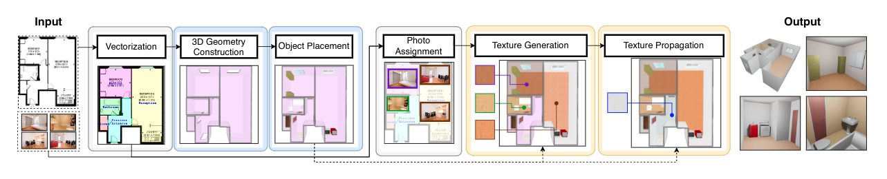 |
| **Hunyuan3D-2 Architecture** | 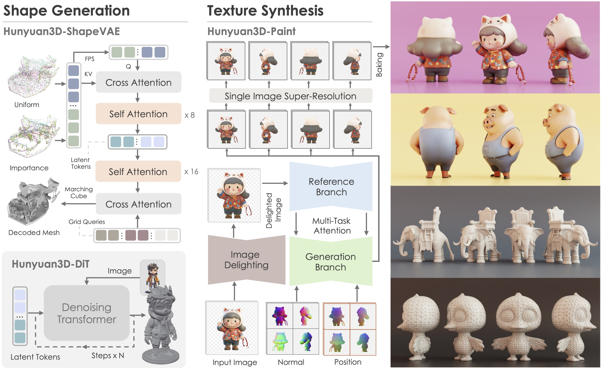 |

Additional local visuals:
- `Orchestrator/assets/*.gif`
- `plan2scene/docs/img/intro.png`
- `Hunyuan3D-2/assets/images/system.jpg`
- `Hunyuan3D-2/assets/images/e2e-1.gif`

---

## 4) Our Contribution Layer (What We Improved)

This FYP is not just a collection of repos. The contribution is the **bridge layer** that turns independent research algorithms into one API-driven scene factory.

### A) `MASt3R-SLAM` Enhancement (Mobile-First, No Tango Dependency)
- Original limitation: older FLOORPLAN pipelines were often tied to RGBD/Tango-style assumptions.
- Our enhancement: monocular mobile video is converted into reusable geometry + trajectory artifacts and passed downstream as contracts.
- Bridge artifact handoff:
	- `geometry_uri`
	- `camera_trajectory_uri`
	- `sparse_map_uri`

### B) `FloorNet` Enhancement (Geometry-to-FLOORPLAN Adapter)
- Original limitation: FloorNet is not natively wired to MASt3R-SLAM outputs.
- Our enhancement: a translation layer converts MASt3R geometry into FLOORPLAN-compatible priors (top-view structure + room semantic envelopes).
- Bridge artifact handoff:
	- `floorplan_raster_uri`
	- `floorplan_vector_uri`
	- `room_types_uri`

### C) `Orchestrator` Enhancement (Structure-Aware Placement)
- Original limitation: prompt-only planning can drift from true room geometry.
- Our enhancement: ORCHESTRATOR constraints are bound directly to FLOORPLAN polygons/room labels before layout generation.
- Bridge artifact handoff:
	- `layout_plan_uri`
	- `collision_report_uri`
	- `scene_prompt_uri`

### D) `Plan2Scene` Enhancement (Automatic Scene JSON + Texture Flow)
- Original limitation: multi-step manual conversion from layout to textured scene.
- Our enhancement: ORCHESTRATOR output + FLOORPLAN vectors are assembled into texture-ready scene JSON and propagation manifests.
- Bridge artifact handoff:
	- `scene_json_uri`
	- `textured_arch_uri`
	- `texture_manifest_uri`

### E) `Hunyuan3D-2` Enhancement (Asset Injection at Pipeline End)
- Original limitation: generated assets are usually detached from architectural scene assembly.
- Our enhancement: Hunyuan3D assets are injected as the final API stage into a deployable scene package.
- Bridge artifact handoff:
	- `asset_bundle_uri`
	- `final_scene_glb_uri`
	- `final_package_uri`

Reference implementation:
- `cloud_utils/main.py`
- `cloud_utils/bridges.py`
- `cloud_utils/BRIDGING.md`

---

## 5) Repository Modules and Their Roles

### `MASt3R-SLAM/`
**Purpose:** real-time dense SLAM backbone (tracking + mapping + relocalization + evaluation).

Key implementation anchors:
- `MASt3R-SLAM/main.py`
	- Loads dataset/calibration
	- Runs tracking + backend factor-graph optimization
	- Supports relocalization and optional visualization process
- `MASt3R-SLAM/mast3r_slam/*.py`
	- dataloader, geometry, optimizer, retrieval, tracking, visualization utilities

Primary outputs:
- Camera trajectory
- Dense geometric reconstruction
- Intermediate geometric priors for downstream floorplan inference

---

### `FloorNet/`
**Purpose:** multi-branch FLOORPLAN reconstruction (point cloud + top-view + image branch fusion).

Key files:
- `FloorNet/train.py`
- `FloorNet/evaluate.py`
- `FloorNet/floorplan_utils.py`
- `FloorNet/IP.py` (free integer-programming alternative to Gurobi flow)

Role in integrated pipeline:
- Converts geometric/visual evidence into structured FLOORPLAN semantics
- Supports vector-graphic floorplan reasoning used before 3D shell construction

---

### `plan2scene/`
**Purpose:** floorplan-to-textured-3D transformation and texture propagation.

Key stage scripts (from module docs):
- Preprocessing crops and embeddings
- VGG crop selection
- GNN texture propagation
- Seam correction + texture embedding
- Scene rendering (`render_house_jsons.py`)

Important docs:
- `plan2scene/docs/md/plan2scene_on_r2v.md`
- `plan2scene/docs/md/conda_env_setup.md`

Role in integrated pipeline:
- Converts structural layouts/scene JSON into coherent textured architectural output

---

### `Orchestrator/`
**Purpose:** prompt-conditioned 2D/3D layout planning with LLM-guided structure and evaluation.

Key files:
- `Orchestrator/run_layoutgpt_2d.py`
- `Orchestrator/run_layoutgpt_3d.py`
- `Orchestrator/parse_llm_output.py`
- `Orchestrator/eval_scene_layout.py`

Role in integrated pipeline:
- Generates object-level layout plans under room/size constraints
- Feeds scene-assembly stage with structured placements
- Supports quantitative scene-layout evaluation

---

### `Hunyuan3D-2/`
**Purpose:** high-fidelity image-to-3D asset generation (shape + texture).

Key interfaces:
- `Hunyuan3D-2/minimal_demo.py`
- `Hunyuan3D-2/gradio_app.py`
- `Hunyuan3D-2/api_server.py`

Role in integrated pipeline:
- Generates detailed object assets from image/semantic cues
- Supplies scene assembly with higher-fidelity object meshes/textures

---

## 6) Cross-Module Bridge (Data Contracts)

In this workspace, modules are composable through intermediate artifacts:

1. **Video / image stream** → `MASt3R-SLAM`
2. **Geometry/top-down structure** → floorplan extraction (`FloorNet` style branching)
3. **Structured layout / scene JSON** → `plan2scene` and `Orchestrator`
4. **Asset generation** (object-level) → `Hunyuan3D-2`
5. **Final assembly + visualization** → renderer / scene viewer / Blender pipelines

Typical bridge artifacts:
- Point clouds / camera poses
- Floorplan vectors / room labels
- `*.scene.json`
- Texture crop directories
- Rendered previews / evaluation metrics

---

## 7) Suggested Execution Blueprint (Research Reproduction)

> Because dependency stacks differ significantly, use **separate environments per module**.

### A) Structural Reconstruction
```bash
cd MASt3R-SLAM
python main.py --dataset <path_to_video_or_dataset> --config config/base.yaml
```

### B) Floorplan Understanding
```bash
cd FloorNet
python train.py --task=evaluate --separateIconLoss
```

### C) Scene Texture Pipeline
```bash
cd plan2scene
export PYTHONPATH=./code/src
python code/scripts/plan2scene/preprocessing/fill_room_embeddings.py <out_dir> test --drop 0.0
python code/scripts/plan2scene/texture_prop/gnn_texture_prop.py <out_dir> <in_dir> test <conf_path> <ckpt_path> --keep-existing-predictions --drop 0.0
```

### D) Layout Orchestration
```bash
cd Orchestrator
python run_layoutgpt_3d.py --dataset_dir ./ATISS/data_output --icl_type k-similar --K 8 --room bedroom --gpt_type gpt4 --unit px --normalize --regular_floor_plan
```

### E) Object Asset Generation
```bash
cd Hunyuan3D-2
python minimal_demo.py
```

---

## 8) Environment Strategy

This monorepo intentionally hosts heterogeneous research codebases:

| Module | Typical Python | Notes |
|---|---:|---|
| `FloorNet` | 2.7 | TensorFlow 1.x era stack |
| `MASt3R-SLAM` | 3.11 | PyTorch 2.5.x + CUDA matching |
| `Orchestrator` | 3.8 | ORCHESTRATOR/GLIGEN/ATISS stack |
| `plan2scene` | 3.6 (docs) | Older PyTorch + geometric deps |
| `Hunyuan3D-2` | 3.8+ | Modern image-to-3D stack |

Recommendation:
- Keep each folder in its own Conda env.
- Treat root as orchestration/documentation layer.
- Promote artifacts via files, not shared runtime imports.

---

## 9) Evaluation and Thesis-Aligned Claims

From thesis abstract context, the integrated pipeline targets:
- Reduced object placement conflicts via AI-guided orchestration.
- Lower compute cost through staged modular processing.
- Scalable scene generation from monocular input.

Use module-level evaluators for reproducibility:
- `MASt3R-SLAM/scripts/eval_*.sh`
- `Orchestrator/eval_scene_layout.py`, `eval_counting_layout.py`, `eval_spatial_layout.py`
- `plan2scene/code/scripts/plan2scene/test.py`

---

## 10) Workspace Map

```text
fyp-2026/
├── FloorNet/          # FLOORPLAN reconstruction (ECCV 2018 lineage)
├── MASt3R-SLAM/       # Dense SLAM backbone (CVPR 2025)
├── Orchestrator/      # ORCHESTRATOR-based scene planning and evaluation
├── cloud_utils/       # Cloud Run serverless orchestration scaffold
├── plan2scene/        # Floorplan-to-textured-scene pipeline
├── Hunyuan3D-2/       # Image-to-3D asset generation
└── Thesis_Report .pdf # Full thesis/report context
```

---

## 11) Unified Cloud Run Deployment (Serverless Narrative)

The repository now supports a **single Cloud Run entrypoint** concept where one serverless service orchestrates all module stages as a pipeline.

Architecture intent:
- One public endpoint on Cloud Run receives video/session jobs.
- A unified orchestrator (`cloud_utils/main.py`) sequences stage adapters for:
	- `MASt3R-SLAM`
	- `FloorNet`
	- `Orchestrator`
	- `plan2scene`
	- `Hunyuan3D-2`
- Artifacts move through staged outputs (e.g., geometry → FLOORPLAN → scene JSON → textured scene).


Prototype deployment files are under `cloud_utils/`:
- `cloud_utils/main.py`
- `cloud_utils/bridges.py`
- `cloud_utils/contracts.py`
- `cloud_utils/BRIDGING.md`
- `cloud_utils/requirements.txt`
- `cloud_utils/Dockerfile`
- `cloud_utils/cloudrun-service.yaml`

Single-call orchestration shape:

```bash
curl -X POST "https://<cloud-run-url>/pipeline/run" \
	-H "Content-Type: application/json" \
	-d '{
		"video_uri": "gs://input-bucket/mobile-capture.mp4",
		"project_id": "fyp-2026",
		"run_mode": "demo",
		"enable_modules": ["mast3r_slam", "floornet", "orchestrator", "plan2scene", "hunyuan3d"]
	}'
```

The response returns:
- `bridge_trace` (exact stage-by-stage handoff)
- `contribution_layer` (what this FYP adds per module)
- final artifact URIs for scene package delivery

> This is a realistic cloud orchestration scaffold for documentation/demo narrative. Module-heavy GPU workloads still need production hardening and infra tuning.

---

## Cloud Orchestration Deep Dive (Bridge-by-Bridge)

This section explains exactly how the system behaves as a **deployment-level cloud product**, not just a research chain.

### Cloud orchestration responsibilities

`cloud_utils/main.py` acts as the runtime coordinator with these responsibilities:
- Accept a single `POST /pipeline/run` request.
- Generate a pipeline `job_id` and track stage lineage.
- Call bridge adapters in order (`cloud_utils/bridges.py`).
- Emit deterministic artifact URIs for every stage handoff.
- Return rich execution metadata (`bridge_trace`, `contribution_layer`).

### Deployment-level topology (renderable)

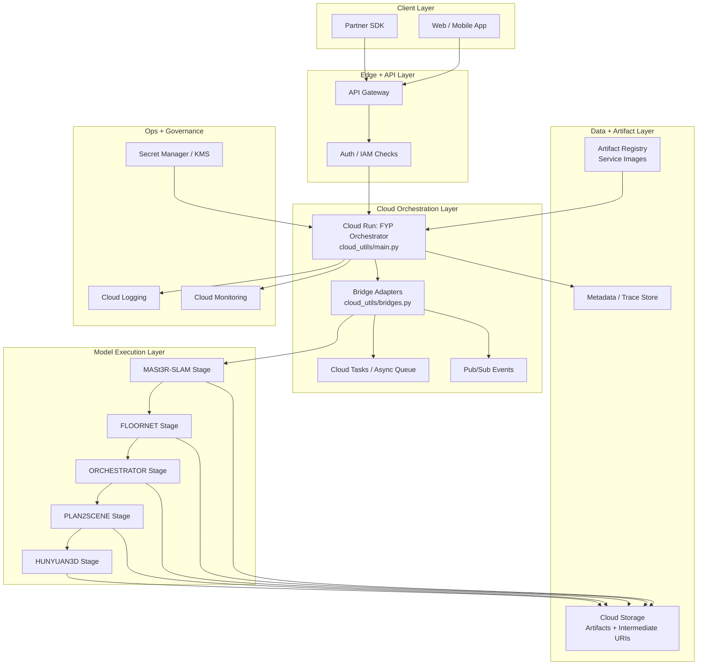

### Control plane vs data plane

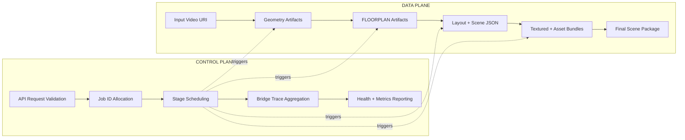

### Stage-by-stage request execution sequence

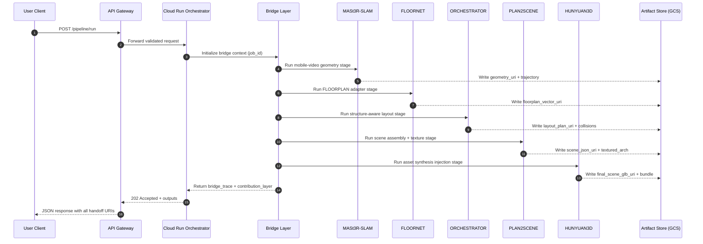

### Job lifecycle and recovery model

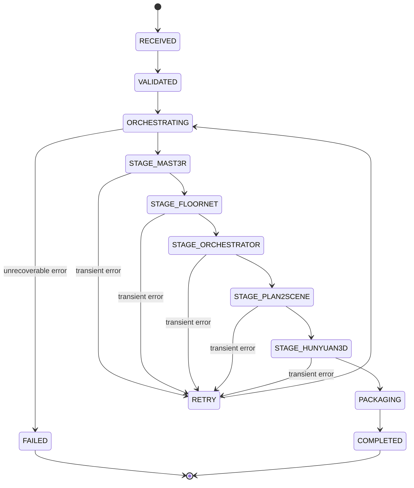

### Bridge contract matrix (deployment view)

| Stage | API-Level Input | Bridge Output | Used By | Deployment Role |
|---|---|---|---|---|
| `mast3r_slam` | `video_uri` | `geometry_uri`, `camera_trajectory_uri`, `sparse_map_uri` | `floornet` | Geometry bootstrap from mobile capture |
| `floornet` | `geometry_uri` | `floorplan_raster_uri`, `floorplan_vector_uri`, `room_types_uri` | `orchestrator`, `plan2scene` | Structural envelope extraction |
| `orchestrator` | `floorplan_vector_uri` | `layout_plan_uri`, `collision_report_uri`, `scene_prompt_uri` | `plan2scene` | Constraint-aware object planning |
| `plan2scene` | `layout_plan_uri`, `floorplan_vector_uri` | `scene_json_uri`, `textured_arch_uri`, `texture_manifest_uri` | `hunyuan3d` | Architectural scene construction |
| `hunyuan3d` | `scene_json_uri` | `asset_bundle_uri`, `final_scene_glb_uri`, `final_package_uri` | Client delivery | Final asset + scene packaging |

### Why this is deployment-ready architecture (narrative)

- The pipeline is represented as a **single public API**, not isolated scripts.
- Every stage is connected through explicit contract URIs (cloud-native handoff).
- The system can run synchronous demo mode now and evolve to queued execution (`Cloud Tasks`, `Pub/Sub`) without changing the external API.
- Observability hooks (`Logging`, `Monitoring`, trace metadata) are architected into the orchestrator boundary.
- This provides a practical path from thesis prototype to production orchestration.

---

## Deployment Architecture Blueprint (Cloud Run Focus)

### Container-level execution model

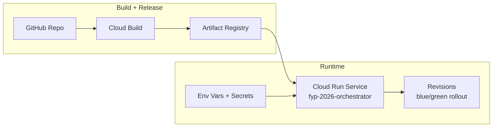

### End-to-end cloud delivery flow

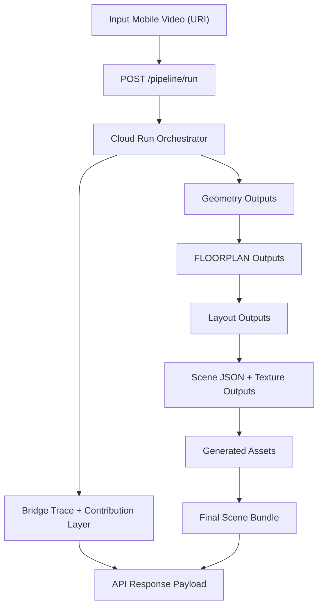

---

## 12) Recognitions

### Conference Proceedings (Base / First-Half Work)

Our base-stage work on monocular floorplan reconstruction has been represented in conference proceedings as:

- **Title:** *AI-based LiDAR-Free Floorplan Generation from Monocular Video*
- **Proceedings:** International Conference on Communication, Computing and Information Technology
- **Host:** Department of Computer Science and Information Technology, M.O.P. Vaishnav College for Women (Autonomous), Chennai, Tamil Nadu, India
- **Conference Dates:** 6–7 February 2026

This forms the first-half foundation that the current repository extends into a fully bridged, cloud-orchestrated multimodal scene pipeline.

### Innovation Award

We also received the **Best Innovation Award** at **SSN iFound** for this line of work.

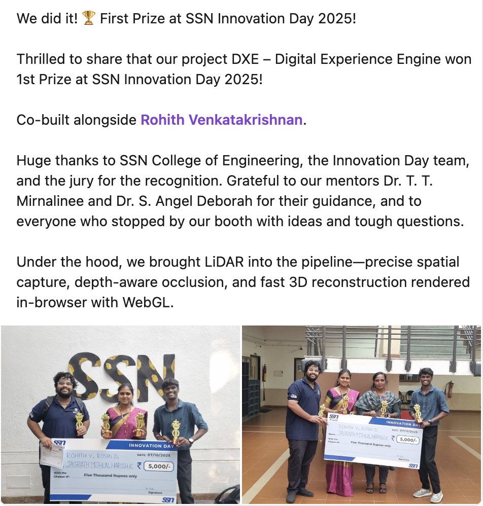

---

## 13) Core References (Papers + Project Pages)

### Floorplan / Structure
- **FloorNet (ECCV 2018)**: https://arxiv.org/abs/1804.00090
- ECCV page: https://openaccess.thecvf.com/content_ECCV_2018/html/Chen_Liu_FloorNet_A_Unified_ECCV_2018_paper.html
- Project page: http://art-programmer.github.io/floornet.html

### Dense Reconstruction / SLAM
- **MASt3R-SLAM (CVPR 2025)**: https://arxiv.org/abs/2412.12392
- Repo: https://github.com/rmurai0610/MASt3R-SLAM

### Orchestration Foundations
- **LayoutGPT (NeurIPS 2023, underlying method)**: https://arxiv.org/abs/2305.15393
- Repo: https://github.com/weixi-feng/LayoutGPT

### Asset Generation
- **Hunyuan3D 2.0**: https://arxiv.org/abs/2501.12202
- Repo: https://github.com/Tencent-Hunyuan/Hunyuan3D-2

### Scene Texturing / Lift
- **Plan2Scene** repo lineage: https://github.com/3dlg-hcvc/plan2scene

---

## 14) Notes for Maintainers

- Root README acts as the **integration narrative** for the full thesis system.
- Subfolder READMEs retain module-specific setup/run details.
- When extending pipeline bridges, prefer adding:
	- explicit input/output contract docs,
	- conversion scripts between stages,
	- minimal reproducible end-to-end benchmark recipes.

---

## 15) Acknowledgement

This workspace builds upon multiple open research projects and preserves their original module structure while framing them into a thesis-level, end-to-end multimodal reconstruction system.